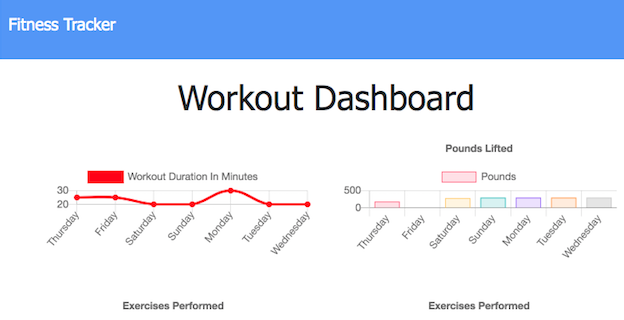

[](https://github.com/maphaiyarath/fitness-tracker)
# NoSQL: Fitness Tracker



You can demo the app [here](https://maphaiyarath-fitness-tracker.herokuapp.com/).

## Table of Contents
* [Description](#description)
* [Installation](#installation)
* [Usage](#usage)
* [Credits](#credits)
* [License](#license)
* [Contributing](#contributing)

## Description
As a user, I want to be able to view create and track daily workouts. I want to be able to log multiple exercises in a workout on a given day. If the exercise is a cardio exercise, I should be able to track my distance traveled. A consumer will reach their fitness goals more quickly when they track their workout progress.

When the user loads the page, they should be given the option to create a new workout or continue with their last workout. The user should be able to:
- Add exercises to the most recent workout plan.
- Add new exercises to a new workout plan.
- View the combined weight of multiple exercises from the past seven workouts on the stats page.
- View the total duration of each workout from the past seven workouts on the stats page.

## Installation
Use the following command for installation:
```bash
npm install
```

To populate the database with `seed.js`, you can run the following:
```bash
node seeders/seed.js
```

## Usage
The application will be invoked by running:
```bash
node server.js
```

## Credits
* [Express.js](http://expressjs.com/)
* [Mongoose](https://www.npmjs.com/package/mongoose)

## License
This project is licensed under the MIT license.

## Contributing
n/a